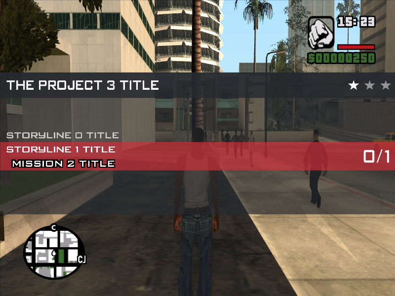

## User Information

CLEO Redux Missions Framework is a scripting modification for GTA: San Andreas that allows launching missions from a special menu. The menu is opened by pressing the `F2` key and looks approximately like the image below:



Use the `A` and `D` keys to switch between connected projects. Each project has its own set of storylines, which can be selected using the `W` and `S` keys. After selecting the desired storyline, press `Enter` to start the mission. The `???` symbols in mission names indicate that the selected mission is currently unavailable, and you must complete other missions first. You can reset the selected project to its initial state (using the `R` key) and replay its missions.
You can choose mission difficulty by pressing `1`, `2`, or `3`. In the menu, difficulty is displayed with white `★` symbols. The more stars, the higher the difficulty. Note that difficulty does not affect the game itself. Developers may also choose to ignore this parameter and program missions at their discretion.

## Requirements and Setup

The modification requires the classic PC version of GTA: San Andreas (version 1.0 US). Other game versions may not work correctly or may not be supported. Ensure that the latest versions of the libraries [CLEO 5](https://github.com/cleolibrary/CLEO5/releases) and [CLEO Redux](https://github.com/cleolibrary/CLEO-Redux/releases) are installed (the modification is tested on versions marked as Latest). Then, extract the archive to the `CLEO` folder in the game directory, so the path to the modification is:

```
<game>\cleo\MFramework[fs][mem]\
```

By default, CLEO Redux imposes access restrictions. Ensure that the parameters `AllowJs`, `AllowFxt`, `mem`, and `fs` are set to `1`. To do this, open the file with a text editor:
```
<game>\cleo\.config\cleo.ini
```

Make changes to the file if the settings differ. This will help avoid issues with displaying in-game texts and saving mission progress.

## Adding New Missions

The modification in its basic configuration includes only the core for launching missions and a test project. To install new missions, download a project from other developers and add it to the `MFramework[fs][mem]` folder. Each project has its own folder, so this should not cause issues. The modification will automatically load all necessary files.
> [!WARNING]
> Before installing or removing projects, fully exit the game!

## Troubleshooting

### The menu does not open if:
- The player is performing another mission;
- The player is moving, in a vehicle, dead, or arrested;
- The player is not outdoors;
- No project with missions has been added to the modification;
- An error occurred in the modification or project;

### Text does not appear in the menu or missions:
- No access to in-game texts (see "Requirements and Setup");
- The `Text.fxt` file is missing in the project's root directory or has an incorrect format;
- The project uses an incorrect root directory for its files;
- The project lacks a storyline or mission;

## To Developers

CLEO Redux Missions Framework provides a set of base classes for quickly using frequently applied commands. The package also includes the `FXT_Easy.exe` program, which simplifies working with FXT files (an alternative to FXTEditor). It supports writing texts in Russian and exporting them to a format compatible with the game.
